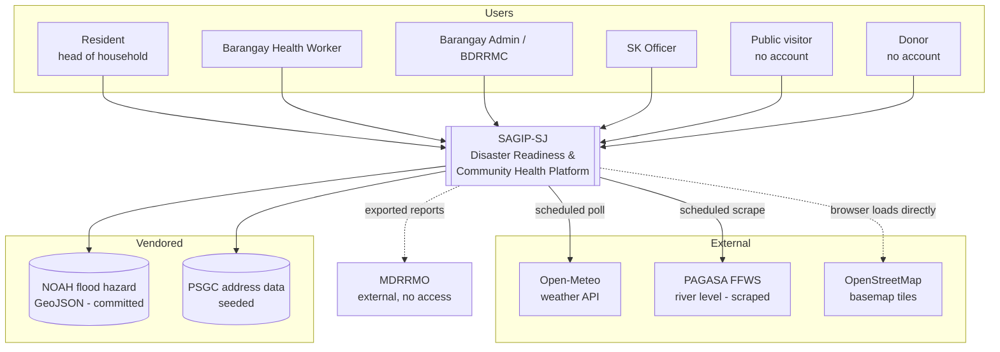
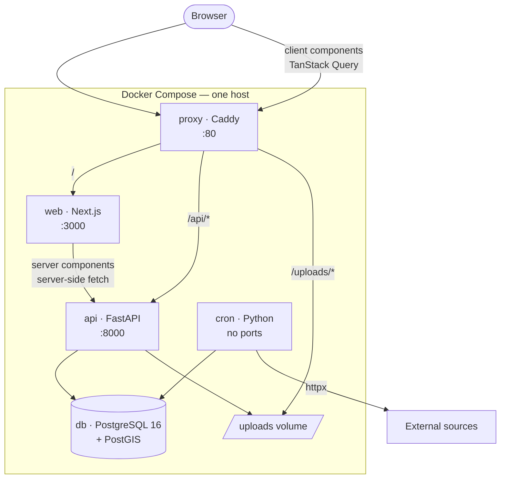
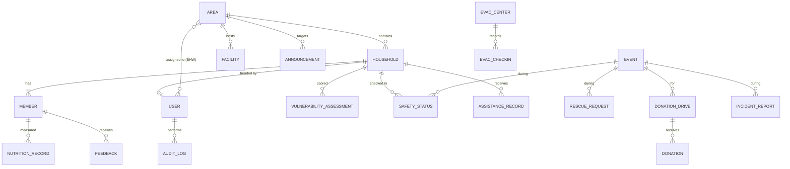
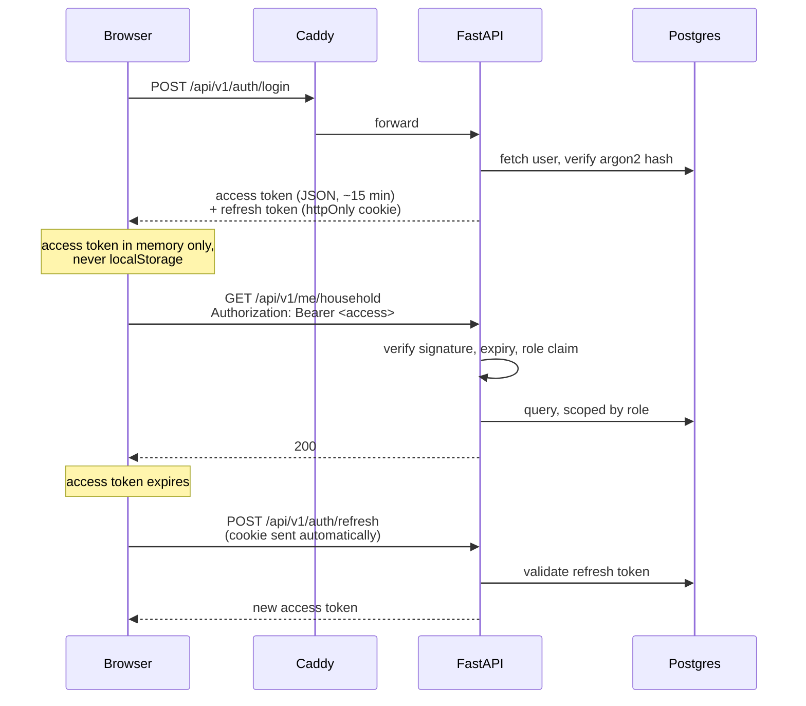
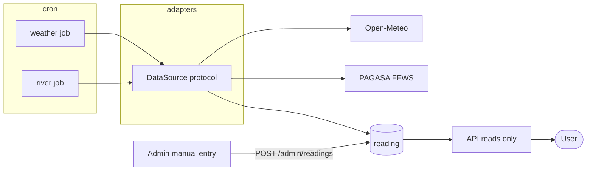
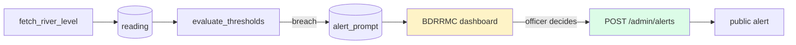
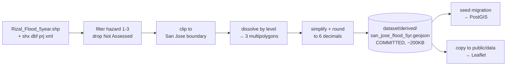

# System Architecture

**Project:** `SAGIP-SJ` (System for Alert, Guidance, Incident Reporting, and Preparedness) — Barangay San Jose Disaster Readiness & Community Health Platform
**Version:** 0.1 (Draft) · **Date:** August 2026

**Companions:** [`business-requirements.md`](./business-requirements.md) · [`frs_nfrs.md`](./frs_nfrs.md) · [`tech_stack.md`](./tech_stack.md) · [`design.md`](./design.md) · [`schema.md`](./schema.md)

> **Scope.** How the system is structured — services, boundaries, data model, API design, repository layout, and deployment topology. *What* to build is in `frs_nfrs.md`; *which tools* is in `tech_stack.md`; *how it looks* is in `design.md`; the physical tables are in `schema.md`.

---

## 1. Architectural Drivers

The requirements that actually shaped this design. Everything else followed from them.

| # | Driver | Source | Consequence |
|---|---|---|---|
| D-1 | **Spatial queries are core, not incidental** — households in areas, households in flood zones, nutrition aggregated by area | BR-2.2, BR-10.2, FR-REG-043 | PostGIS is load-bearing. Spatial logic lives in the database, not in Python |
| D-2 | **Emergency paths must work when everything else fails** | BR-0.17, FR-SAF-009, NFR-AVL-004 | Anonymous rescue endpoint with no auth dependency; hotlines served statically; section-level failure isolation |
| D-3 | **External data is unreliable and must never block a page** | BR-3.8, NFR-AVL-002/003 | All upstream data is fetched by a scheduler and read from the database. No request path ever calls an external service |
| D-4 | **Alerts are human-issued, never automated** | BR-3.4, FR-WX-009 | The threshold evaluator creates a *prompt*, not an alert. No code path publishes to the public without an officer |
| D-5 | **A team of five, mostly non-IT, on a competition timeline** | R-8 | One deployable API, one database, no service boundaries, no message broker |
| D-6 | **Runs identically on a laptop and a single VPS** | tech_stack 9 | One Compose file, environment-driven config, no cloud-managed dependencies |
| D-7 | **Registry is opt-in and partial** | BRD 4.4 | Registered counts are derived; barangay totals are configuration. Two different things, never the same column |

---

## 2. System Context



**Boundary notes**

- **MDRRMO is outside the system.** It receives exported files; it has no account and no integration (BRD 4.0).
- **OSM tiles load browser-to-OSM directly.** They never transit our server.
- **NOAH and PSGC are vendored** — committed to the repo and loaded at migration time. Not runtime dependencies (D-3).
- **Only two live external dependencies exist**, both reached exclusively by the scheduler.

---

## 3. Container View



| Container | Responsibility | Scaling |
|---|---|---|
| `proxy` | Single entry point; path routing; static upload serving; TLS if enabled | 1 |
| `web` | Next.js — public site SSR/ISR, portal and console as a client app | 1 |
| `api` | All business logic, authorization, persistence | Gunicorn + Uvicorn workers |
| `cron` | Scheduled ingestion and maintenance. **No HTTP surface** | Exactly 1 — see Section 9 |
| `db` | PostgreSQL + PostGIS. Single source of truth | 1 |
| `uploads` | Incident photos on a bind volume, served by the proxy | — |

> **Why `cron` is a separate container and not APScheduler inside `api`.** With more than one Gunicorn worker, in-process schedulers fire the same job once per worker — duplicate scrapes, duplicate alerts, duplicate reminders. A dedicated single-replica container makes that impossible by construction rather than by convention.

---

## 4. Backend Structure

One FastAPI application, organised by module. Not microservices (D-5) — module boundaries are enforced by directory and import discipline, not by network calls.

```
apps/api/src/
├── main.py                  app assembly, middleware, router mounting
├── core/
│   ├── config.py            pydantic-settings, env-driven
│   ├── security.py          JWT issue/verify, argon2 hashing
│   ├── deps.py              FastAPI dependencies: current_user, require_role, area_scope
│   ├── errors.py            exception handlers, RFC7807-style envelope
│   └── logging.py           structured JSON logs, request IDs
├── db/
│   ├── session.py           engine, session factory
│   ├── base.py              declarative base, mixins (timestamps, soft delete)
│   └── models_registry.py   imports every models.py — Alembic autogenerate reads this
├── modules/
│   ├── auth/                FR-SYS-001..004
│   ├── users/               FR-SYS-005..009
│   ├── config/              FR-SYS-010, reference data
│   ├── registry/            FR-REG-*  ← largest module
│   ├── geo/                 areas, facilities, hazard layers, spatial queries
│   ├── weather/             FR-WX-*
│   ├── alerts/              FR-ALT-*
│   ├── safety/              FR-SAF-*
│   ├── evacuation/          FR-EVC-*
│   ├── donations/           FR-DON-*
│   ├── activities/          FR-ACT-*
│   ├── preparedness/        FR-PRP-*
│   └── analytics/           FR-ANL-*
├── integrations/
│   ├── base.py              DataSource protocol — fetch, parse, health
│   ├── open_meteo.py
│   ├── pagasa.py            scraper, isolated
│   └── manual.py            admin-entered readings (FR-WX-007)
└── domain/
    ├── vulnerability.py     classification engine — pure functions, heavily tested
    └── alert_levels.py      threshold evaluation — pure functions
```

Each module follows the same four files:

```
router.py     HTTP surface — thin, no business logic
schemas.py    Pydantic request/response models
service.py    business logic, transaction boundaries
models.py     SQLAlchemy ORM
```

> **Alembic lives at `apps/api/alembic/`**, beside `alembic.ini` and as a sibling of `src/` and `tests/` — see the repository layout in Section 12.2. An earlier draft of this tree showed it as `src/db/migrations/`; that was inconsistent with 12.2 and is corrected above.

**Rules that keep this from rotting**

1. **Routers never touch the database.** They call services.
2. **Services never import another module's `models.py`.** Cross-module access goes through the owning service.
3. **`domain/` is pure.** No I/O, no ORM, no framework imports — which is why it is the one place with a real unit test suite (NFR-MNT-005).
4. **Authorization lives in `deps.py`**, applied as a router dependency. Never inside a service, never in the frontend.
5. **Every `models.py` is imported by `db/models_registry.py`.** Alembic's autogenerate compares `Base.metadata` against the live database; a model nothing imports is absent from that metadata, and autogenerate will emit a migration that *drops its table*.

---

## 5. Data Architecture

### 5.1 Core entities



> **Full physical schema — every column, type, constraint, and index — is in [`schema.md`](./schema.md).** What follows is the shape and the reasoning.

### 5.2 Tables that carry design weight

**`household`** — the anchor.

| Column | Notes |
|---|---|
| `id`, `reference_no` | Reference generated at creation (FR-REG-006) |
| `head_name`, `contact_number` | Contact nullable (FR-REG-005) |
| `unreachable_by_phone` | Derived on write; feeds capacity scoring |
| `area_id` | FK; **also derivable** via `ST_Contains` when a geotag exists |
| `location` | `GEOMETRY(Point, 4326)`, nullable |
| `address_psgc` | PSGC codes + free-text street |
| `verified_at`, `verified_by` | Verification does not gate service (FR-REG-011) |
| `created_by_user_id`, `source` | `self` or `bhw` — needed for the coverage metric |
| `deleted_at` | Soft delete (NFR-DAT-004) |

**`member`** — carries the vulnerability flags directly as booleans (`is_child`, `is_senior`, `is_pwd`, `is_pregnant`, `has_chronic_condition`, `is_bedridden`). Booleans rather than a lookup table because the set is fixed by BR-1.32, small, and queried on every classification pass.

**`vulnerability_assessment`** — **append-only**, never updated.

| Column | Notes |
|---|---|
| `household_id`, `computed_at` | |
| `level` | `low` · `moderate` · `high` · `priority` |
| `factors` | `JSONB` — the contributing factors, for explainability (FR-REG-045) |
| `override_level`, `override_reason`, `override_by` | Manual override with mandatory reason (FR-REG-046) |

> Keeping this append-only means the household's risk history is a free by-product, and a bad classifier change is diagnosable rather than destructive.

**`reading`** — one table for every external measurement.

| Column | Notes |
|---|---|
| `source` | `open_meteo` · `pagasa` · `manual` |
| `metric` | `river_level` · `rainfall` · `temperature` · `heat_index` |
| `value`, `unit`, `observed_at`, `fetched_at` | Both timestamps — the gap *is* the staleness (FR-WX-011) |
| `raw` | `JSONB` payload, kept for debugging a broken parser |

Every reading surfaced to a user carries `source` and `observed_at` (FR-WX-010). A value without an age is never rendered.

**`config`** — typed key/value for admin-editable settings: barangay population and household totals, alert thresholds, staleness windows. Keeps FR-ANL-002 out of the codebase and in the hands of the barangay.

### 5.3 Spatial model

| Object | Type | Source |
|---|---|---|
| Area boundaries | `GEOMETRY(MultiPolygon, 4326)` | Seeded (FR-SYS-013) |
| Household location | `GEOMETRY(Point, 4326)` | Draggable pin |
| Facilities | `GEOMETRY(Point, 4326)` | Admin-managed |
| Siren alert units | `GEOMETRY(Point, 4326)` | Admin-managed & triggerable simulation (FR-MAP-014, FR-ALT-012) |
| Flood hazard | `GEOMETRY(MultiPolygon, 4326)` | Vendored GeoJSON, seeded per return period |

**Everything is EPSG:4326.** The NOAH shapefiles arrive in WGS84, Leaflet expects WGS84, GeoJSON's default is WGS84 — so no reprojection exists anywhere in the system. GiST indexes on all four geometry columns.

The three spatial queries that matter — this is the whole of the PostGIS surface area, and T-4's "learning curve" risk amounts to these:

```sql
-- 1. assign a household to its area
SELECT a.id FROM area a WHERE ST_Contains(a.geom, :point);

-- 2. households in a hazard zone (FR-REG-043)
SELECT h.id, MAX(f.level) AS hazard_level
FROM household h
JOIN flood_hazard f
  ON ST_Contains(f.geom, h.location)
WHERE f.return_period = 5
GROUP BY h.id;

-- 3. distance to the nearest evacuation centre
SELECT h.id,
       MIN(ST_Distance(h.location::geography, e.location::geography)) AS metres
FROM household h CROSS JOIN evac_center e
GROUP BY h.id;
```

> **`::geography` for distance, `geometry` for containment.** Distance in raw 4326 units returns degrees, which is meaningless. Casting to `geography` gives metres.

### 5.4 Derived vs configured — the distinction the BRD insists on

| Figure | Origin | Table |
|---|---|---|
| Registered households | `COUNT(*)` at query time | `household` |
| Registered members | `COUNT(*)` at query time | `member` |
| **Barangay-wide households** | Admin-entered | `config` |
| **Barangay-wide population** | Admin-entered | `config` |

Never stored as duplicate columns, never conflated (NFR-DAT-005, FR-ANL-003). Coverage is always presented as *derived over configured*.

---

## 6. API Design

REST over JSON at `/api/v1`. OpenAPI at `/api/docs`.

### 6.1 Conventions

| Concern | Convention |
|---|---|
| Naming | Plural nouns, kebab-case: `/households`, `/rescue-requests` |
| Pagination | `?page=1&size=20` → `{ items, total, page, size, pages }` |
| Filtering | Explicit query params. No generic filter DSL |
| Sorting | `?sort=created_at&order=desc` |
| Errors | RFC 7807-shaped: `{ type, title, status, detail, errors[] }` |
| Validation | Pydantic; 422 with field-level detail |
| Timestamps | ISO 8601, UTC, `Z` suffix. Display conversion is the frontend's job (NFR-DAT-003) |
| Geometry | GeoJSON in and out |
| Idempotency | `PUT` for full replace, `PATCH` for partial |

### 6.2 Access tiers

```
/api/v1/public/*      no auth — the entire public site
/api/v1/me/*          authenticated resident (head of household)
/api/v1/admin/*       barangay admin, BHW, SK — role-checked per route
```

Splitting by tier rather than by resource means a public endpoint cannot accidentally inherit an authenticated one's serializer and leak household data (FR-PUB-014).

### 6.3 Selected endpoints

**Public — no authentication**

```
GET  /public/announcements
GET  /public/weather/current
GET  /public/river-level
GET  /public/evacuation-centers
GET  /public/hotlines
GET  /public/facilities
GET  /public/hazard-layers/{period}     GeoJSON, heavily cached
GET  /public/area-stats                 area-level aggregates only
GET  /public/donation-drives
POST /public/donations                  FR-DON-002 — no account
POST /public/rescue-requests            FR-SAF-009 — no account, rate limited
GET  /public/activities
GET  /public/guides
GET  /public/guides/{slug}              FR-PUB-005 — "each card opens the full guide"
GET  /public/faqs                       FR-PUB-011, FR-PRP-005
GET  /public/flood-events               FR-WX-013 — flood history, publicly viewable
```

> The last three were missing from this list while the requirements that need them
> were already marked mandatory. `/public/guides/{slug}` is the only detail route
> the public site needs — everything else is a list, because the landing page is
> one document rather than a set of drill-downs.
>
> Note also that `/public/weather/current` breaks the plural-noun convention above.
> Left as-is because it reads better than `/public/weather-readings?latest=true`,
> but it is the one exception.

**Resident**

```
GET   /me/household
PATCH /me/household
POST  /me/household/members
PATCH /me/household/members/{id}
GET   /me/feedback
POST  /me/safety-status            per member or whole household
GET   /me/assistance
GET   /me/go-bag
PUT   /me/go-bag
```

**Admin**

```
GET   /admin/households              paginated, filterable, area-scoped for BHW
POST  /admin/households              assisted registration
GET   /admin/households/{id}
POST  /admin/households/{id}/vulnerability-override
GET   /admin/households/duplicates
POST  /admin/households/merge
POST  /admin/members/{id}/feedback
GET   /admin/rescue-requests         queue with triage ordering
PATCH /admin/rescue-requests/{id}
POST  /admin/safety-status           on behalf of a resident, incl. unregistered
GET   /admin/accounted-for           live counts by area
POST  /admin/alerts
DELETE /admin/alerts/{id}
GET   /admin/alert-prompts           threshold breaches awaiting a decision
POST  /admin/readings                manual river level (FR-WX-007)
GET   /admin/evacuation-centers
POST  /admin/evacuation-centers/{id}/checkins
PATCH /admin/donations/{id}/status
GET   /admin/analytics/*
GET   /admin/audit-log
PUT   /admin/config/{key}
```

### 6.4 Two endpoints that are architecturally special

**`POST /public/rescue-requests`** (FR-SAF-009) — the one endpoint that must work when nothing else does.

- No authentication, no session, no database read on the request path
- Minimal payload: name, contact, location, description
- Rate limited by IP, but **the limit is generous** — a false positive here means turning away a real emergency (R-11)
- Writes and returns immediately; triage happens asynchronously
- Never returns anything implying a rescue is guaranteed (FR-SAF-017)

**`GET /public/hazard-layers/{period}`** — served from vendored data with a long `Cache-Control`. Effectively a static file behind an API route.

---

## 7. Authentication & Authorization

### 7.1 Token flow



**Access token in memory, refresh token in an httpOnly cookie.** The access token is never persisted, so an XSS payload cannot read it from storage; the refresh token is never readable by JavaScript at all. `Secure` is set from an environment variable so the same code works on plain HTTP and HTTPS (tech_stack 9).

### 7.2 Authorization layers

Three checks, all server-side, applied in order:

```python
# 1. authentication
current_user = Depends(get_current_user)

# 2. role
@router.get("/admin/households", dependencies=[Depends(require_role("admin", "bhw"))])

# 3. area scope — a query filter, not a condition
def apply_area_scope(query, user):
    if user.role == "bhw":
        return query.filter(Household.area_id.in_(user.assigned_area_ids))
    return query
```

> **Area scoping is applied in the data layer, never the router.** A route that forgets the filter leaks the whole barangay; a repository that applies it by default cannot. FR-SYS-007 is tested with an explicit cross-area 403 case.

---

## 8. External Data Architecture

The central rule, from D-3:

> **No HTTP request from a user ever triggers an outbound call to an external service.** The scheduler writes to the database; the API reads from the database. Always.



### 8.1 The adapter contract

```python
class DataSource(Protocol):
    name: str
    def fetch(self) -> list[Reading]: ...
    def health(self) -> SourceHealth: ...
```

Three implementations — `OpenMeteoSource`, `PagasaSource`, `ManualSource` — so a broken PAGASA parser is one file, not a refactor (T-1, NFR-MNT-009).

### 8.2 Failure behaviour, in order

1. **Fetch fails** → log with source and reason (NFR-OBS-003); do not write.
2. **Read path** always returns the most recent reading regardless of age.
3. **Staleness** is computed at read time from `observed_at` against a configurable window, and returned as a field — the API never hides it.
4. **Nothing ever** returns an empty weather panel because a fetch failed. It returns yesterday's number, labelled as yesterday's (NFR-AVL-003).

### 8.3 Manual override as a first-class source

`ManualSource` is not a fallback bolted on — it writes to the same `reading` table with `source='manual'` and full attribution. When the scraper dies during the storm it exists for, a barangay officer types the number in and every downstream feature keeps working unchanged (FR-WX-007).

---

## 9. Scheduled Jobs

Single-replica `cron` container. Jobs are plain Python functions invoked by the container's scheduler.

| Job | Cadence | Writes | Requirement |
|---|---|---|---|
| `fetch_weather` | 20 min | `reading` | FR-WX-003 |
| `fetch_river_level` | 15 min | `reading` | FR-WX-008 |
| `evaluate_thresholds` | after each river fetch | `alert_prompt` | FR-WX-009 |
| `flag_stale_records` | daily 02:00 | `household.stale_at` | R-2 |
| `send_activity_reminders` | daily 08:00 | `notification` | FR-ACT-005 |
| `backup_database` | daily 03:00 | off-box dump | NFR-AVL-005 |

**Job discipline**

- Every job is **idempotent** — a double run must be harmless.
- Every job logs start, outcome, and duration (NFR-OBS-002).
- A failing job never blocks the next run.
- **No job writes to a user-visible surface.** `evaluate_thresholds` creates an `alert_prompt` for the BDRRMC; publishing an alert requires `POST /admin/alerts` by a named officer (D-4).



The human step in the middle is the architecture, not a formality.

---

## 10. Frontend Architecture

### 10.1 Rendering strategy — by surface, not globally

| Surface | Strategy | Why |
|---|---|---|
| Public landing | **ISR**, ~60s revalidate | Fast on a cheap phone; content changes slowly (NFR-PERF-001) |
| Public hazard map | Static shell + client-side GeoJSON | Map libraries are client-only |
| Emergency alert banner | **Client-side, short poll** | Must reflect reality within seconds, not a revalidation window |
| Resident portal | Client-side (CSR) | Per-user data, no SEO value |
| Admin console | Client-side (CSR) | An application, not a document |

> **Only the public site benefits from server rendering.** Making the whole app SSR would add auth-on-the-server complexity for zero user-visible gain.

### 10.2 Structure

```
apps/web/src/
├── app/
│   ├── (public)/          landing, guides, hazard map, donate — ISR
│   ├── (auth)/            login, register
│   ├── (portal)/          resident — CSR, auth-guarded
│   └── (admin)/           console — CSR, role-guarded
├── components/
│   ├── ui/                shadcn primitives — not edited
│   ├── common/            app composites (design.md 7.2)
│   └── features/          domain components
├── lib/
│   ├── api/               axios instance, typed clients, Zod response schemas
│   ├── auth/              token handling, refresh interceptor
│   └── brand.ts           APP_NAME constant
└── hooks/
```

### 10.3 State

| Kind | Owner |
|---|---|
| Server data | **TanStack Query** — the default for almost everything |
| Forms | React Hook Form + Zod |
| Auth session | Context; access token in memory |
| Ephemeral UI | Local `useState` |
| Cross-cutting UI (active alert, map layers) | Zustand — deliberately small |

**No global store of server data.** Query owns the cache; duplicating it into Zustand is how staleness bugs get created.

### 10.4 Map components

| Component | Loading |
|---|---|
| `HazardMap` (Leaflet) | `dynamic(..., { ssr: false })` — Leaflet touches `window` at import |
| `ZoneMap3D` (R3F) | `dynamic` + `Suspense`, **and gated** on viewport ≥ `md` and `hardwareConcurrency > 4` (FR-MAP-012) |
| Recharts | `dynamic` — never in the landing bundle (NFR-PERF-007) |

---

## 11. Geospatial Pipeline

A **build-time** pipeline, not a runtime one. Runs once per return period; output is committed.



Two consumers, one artifact:

- **PostGIS** — so `ST_Contains` can classify household exposure server-side (FR-REG-043)
- **Static asset** — so Leaflet renders the layer client-side with no API call (FR-MAP-004)

> **Dissolving by hazard level before simplifying** is the single biggest size reduction: thousands of small polygons collapse to three multipolygons. Doing it in the other order wastes most of the benefit.

The script lives in `tools/prepare_hazard.py` and is **not** part of the running system — it is a maintenance tool, not a build step. The committed output in `dataset/derived/` is what everything actually reads (Section 12.5). If the source data is ever updated, someone re-runs `make hazard` and commits the new GeoJSON.

---

## 12. Repository Layout — Monorepo

One repository holds the frontend, backend, tooling, infrastructure, and docs.

### 12.1 Why a monorepo here

| Reason | Detail |
|---|---|
| **One deployable unit** | The whole system ships as a single Compose stack (D-6). Splitting the repo would mean coordinating versions across repos to deploy one thing |
| **Contract stays in sync** | The API's OpenAPI schema generates the frontend's TypeScript types. In one repo a breaking change fails CI in the same PR; across two repos it fails in production |
| **Five people, one review queue** | Cross-cutting changes — add a field, expose it, render it — are one PR against one FRS requirement, not three |
| **Docs travel with code** | `frs_nfrs.md` must be updated in the same PR that implements a requirement. That only works if they live together |
| **Nobody has to clone four things** | NFR-MNT-008: a new member runs the stack in under 30 minutes |

### 12.2 Layout

```
project-pitching/
├── apps/
│   ├── web/                    Next.js
│   │   ├── src/                (see Section 10.2)
│   │   ├── public/
│   │   │   └── data/           hazard GeoJSON, copied from dataset/derived/ — gitignored
│   │   ├── package.json
│   │   └── Dockerfile
│   └── api/                    FastAPI
│       ├── src/                (see Section 4)
│       ├── tests/
│       ├── alembic/
│       ├── pyproject.toml
│       └── Dockerfile
│
├── packages/
│   └── api-types/              TS types generated from OpenAPI — never hand-edited
│       ├── src/generated.ts
│       └── package.json
│
├── services/
│   └── cron/                   scheduled jobs
│       ├── jobs/
│       ├── pyproject.toml
│       └── Dockerfile
│
├── tools/                      one-off developer scripts, not runtime
│   ├── prepare_hazard.py       shapefile → clipped GeoJSON (Section 11)
│   ├── fetch_boundary.py       OSM Overpass → San Jose boundary
│   └── seed/                   demo data generators
│
├── infra/
│   ├── compose.yml             the stack
│   ├── compose.override.yml    local dev — hot reload, exposed ports
│   ├── caddy/Caddyfile
│   └── scripts/                backup.sh, restore.sh
│
├── dataset/
│   ├── raw/                    GITIGNORED — bulky source downloads
│   │   └── Rizal_Flood_5year.{shp,shx,dbf,prj,xml}
│   ├── derived/                COMMITTED — the canonical clipped outputs
│   │   ├── san_jose_flood_5yr.geojson
│   │   ├── san_jose_flood_25yr.geojson
│   │   ├── san_jose_flood_100yr.geojson
│   │   └── san_jose_boundary.geojson
│   └── README.md               provenance + the command that regenerates each file
│
├── docs/                       BRD, FRS/NFRS, tech stack, design, architecture, schema
│
├── .github/workflows/          CI
├── package.json                npm workspaces root
├── Makefile                    the only entry point anyone needs to learn
└── .env.example
```

### 12.3 Polyglot tooling

Two ecosystems, so no single workspace tool covers everything. **A `Makefile` is the top-level interface**, and it is the only thing a team member has to remember.

| Layer | Tool | Scope |
|---|---|---|
| JS/TS | **npm workspaces** | `apps/web`, `packages/api-types` |
| Python | **uv** (or venv + pip) | `apps/api`, `services/cron` — separate envs |
| Orchestration | **Make** | `make dev`, `make test`, `make lint`, `make seed`, `make types` |
| Containers | **Docker Compose** | Everything, identically local and on the VPS |

```makefile
dev:        ## start the whole stack with hot reload
	docker compose -f infra/compose.yml -f infra/compose.override.yml up

test:       ## run api and web test suites
	cd apps/api && pytest
	cd apps/web && npm test

lint:
	cd apps/api && ruff check .
	cd apps/web && npm run lint

types:      ## regenerate the API client types
	cd apps/api && python -m src.main --export-openapi > ../../packages/api-types/openapi.json
	npx openapi-typescript packages/api-types/openapi.json -o packages/api-types/src/generated.ts

hazard:     ## rebuild dataset/derived/ from dataset/raw/, then copy into the web app
	python tools/prepare_hazard.py --period 5 --period 25 --period 100
	cp dataset/derived/*.geojson apps/web/public/data/
```

> **Deliberately not Nx or Turborepo.** Both are built for many JS packages with expensive shared builds. Here there is one frontend, one backend, and a different language on each side — the caching they offer buys nothing, and the configuration is a tax on a team that mostly is not IT.

### 12.4 The shared contract — `packages/api-types`

The one monorepo benefit worth building deliberately (AR-7):

```
FastAPI route + Pydantic schema
        ↓  make types
  openapi.json
        ↓  openapi-typescript
  packages/api-types/src/generated.ts
        ↓  imported by
  apps/web/src/lib/api/*
```

**`generated.ts` is never hand-edited and is committed.** Committing it means CI can diff it: if a PR changes an API response without regenerating, the diff is empty and the check fails loudly. Combined with Zod-parsing responses at runtime, a backend change surfaces as a type error at build time *and* a clear runtime error — not as `undefined` on a dashboard.

### 12.5 What is and is not committed

**The rule: raw source is downloaded, derived output is committed.** `dataset/` holds both, split by subdirectory.

| Path | Committed? | Why |
|---|---|---|
| `dataset/raw/**` | **No** | Province shapefiles are hundreds of MB and re-downloadable |
| **`dataset/derived/*.geojson`** | **Yes** | A few hundred KB each. **The canonical hazard data lives here** |
| `dataset/README.md` | Yes | Provenance and the exact regeneration command |
| `packages/api-types/src/generated.ts` | Yes | So CI can diff it (Section 12.4) |
| `docs/**` | Yes | |
| `apps/web/public/data/*.geojson` | **No** | Copied from `dataset/derived/` by `make hazard` — a build artifact, not a second source of truth |
| `.env` | No | Secrets (NFR-SEC-010) |
| `.next`, `node_modules`, `__pycache__`, `.venv` | No | Build artifacts |
| `uploads/` | No | Runtime user content — lives on a volume |

**Why the clipped GeoJSON is committed and the shapefiles are not:**

- **It is the actual input to the running system.** Both the seed migration and Leaflet read it. Anyone who clones the repo can run the stack with a working hazard map, no downloads, no GIS tooling.
- **It is small and diffable.** A few hundred KB of text; a change to the clip is visible in review.
- **The source is fragile.** LiPAD downloads already corrupted once. Depending on a re-download to rebuild the map is a demo-day risk.
- **Regeneration is rarely needed.** These are historical model outputs. `make hazard` exists for when the source data is genuinely updated — not as a build step.

> **`dataset/derived/` is the single source of truth in git; `apps/web/public/data/` is a copy.** `make hazard` writes both, and the `public/` copy is gitignored so the same bytes never live in two places in version control.

`dataset/README.md` records, per file: the source URL, download date, licence, and the exact command that produced the derived output.

### 12.6 CI with path filters

One workflow, jobs gated on what changed:

| Job | Triggers on | Runs |
|---|---|---|
| `api` | `apps/api/**`, `services/cron/**` | ruff, pytest, alembic upgrade against a throwaway Postgres+PostGIS |
| `web` | `apps/web/**`, `packages/**` | eslint, tsc, next build |
| `types` | `apps/api/**` | regenerate and fail if `generated.ts` differs |
| `docs` | `docs/**` | link check |

### 12.7 Commit scopes

The Conventional Commit scopes in `frs_nfrs.md` Section 1.2 map to directories, so a scope is always verifiable against the diff:

```
feat(api/registry):  …   apps/api/src/modules/registry
feat(web/portal):    …   apps/web/src/app/(portal)
chore(infra):        …   infra/
docs(frs):           …   docs/frs_nfrs.md
```

---

## 13. Deployment

### 13.1 Environments

| Environment | Runs on | Data | Secure context |
|---|---|---|---|
| Local dev | Laptop, Compose | Seeded synthetic | Yes — `localhost` is exempt |
| Demo | Laptop, Compose | Seeded + scripted flood scenario | Yes |
| VPS | Single host, same Compose | Seeded synthetic | Only if sslip.io is enabled |

**One Compose file, environment-driven differences.** No separate production stack — that is what makes "demo from a laptop" a viable fallback if the VPS dies (T-3).

### 13.2 Configuration

All configuration is environment variables, loaded through `pydantic-settings`. `.env.example` is committed; `.env` never is (NFR-SEC-010).

```
DATABASE_URL, JWT_SECRET, ACCESS_TOKEN_MINUTES, REFRESH_TOKEN_DAYS,
COOKIE_SECURE, CORS_ORIGINS, OPEN_METEO_LAT, OPEN_METEO_LON,
PAGASA_STATION, SCRAPE_INTERVAL_MINUTES, STALE_THRESHOLD_MINUTES,
UPLOAD_DIR, MAX_UPLOAD_MB, LOG_LEVEL, DEMO_MODE
```

`DEMO_MODE=true` switches the readings source to a scripted timeline (FR-WX-016) — the pitch runs on data the team controls, and the flag is the only difference.

### 13.3 Startup order

```
db → (healthcheck) → api (runs alembic upgrade head) → web → proxy
                  └→ cron
```

Migrations run on API start, not in a separate step. One less thing to forget.

### 13.4 Backup

`pg_dump` daily to a second location. **Restore is verified at least once before the pitch** (NFR-AVL-006) — an untested backup is not a backup.

---

## 14. Cross-Cutting Concerns

| Concern | Approach |
|---|---|
| **Logging** | Structured JSON, request ID propagated through middleware (NFR-OBS-001) |
| **Errors** | Single exception handler → consistent envelope. Internals never leak to clients |
| **Audit** | `audit_log` written by a service-layer helper on every state change: actor, action, target, timestamp (FR-SYS-008) |
| **Soft delete** | `deleted_at` mixin; default query filter excludes deleted rows |
| **Timestamps** | UTC everywhere in storage and transport; PHT only at render |
| **Uploads** | Type and size validated server-side; stored outside the web root; served by the proxy (NFR-SEC-008) |
| **Rate limiting** | `slowapi` on login and rescue endpoints. Generous on rescue by design |
| **Health** | `/health` returns app and database status (NFR-OBS-004) |
| **Migrations** | Alembic only. No manual DDL, ever (NFR-MNT-004) |

---

## 15. Key Decisions

| # | Decision | Alternative rejected | Rationale |
|---|---|---|---|
| A-1 | Modular monolith | Microservices | Five people, weeks, one barangay (D-5) |
| A-2 | PostGIS in the database | Spatial logic in Python | Point-in-polygon per request does not scale, and the queries are trivial in SQL (D-1) |
| A-3 | Scheduler-writes / API-reads | On-demand external fetch | External failure must never reach a user (D-3) |
| A-4 | Separate `cron` container | APScheduler in the API | Multi-worker duplicate execution |
| A-5 | Access token in memory, refresh in httpOnly cookie | Token in `localStorage` | XSS cannot read either |
| A-6 | Area scoping in the data layer | Route-level checks | A forgotten filter leaks the barangay |
| A-7 | Vendored hazard GeoJSON | Runtime fetch from NOAH | Zero dependency on demo day; the data does not change |
| A-8 | Append-only vulnerability assessments | Mutable level column | Free history; classifier changes stay diagnosable |
| A-9 | Anonymous rescue endpoint | Auth-gated | Requiring registration before rescue is the worst possible failure (D-2) |
| A-10 | Alert prompts, never auto-publish | Automated alerts on threshold | A student prototype must not warn 143,000 people unsupervised (D-4) |
| A-11 | Tier-split API namespaces | Resource-split with per-route auth | Public routes cannot inherit authenticated serializers |
| A-12 | Rendering strategy per surface | SSR everywhere | Auth-on-server complexity for no gain in the portal |
| A-13 | **Monorepo** | Split web/api repos | One deployable unit; the OpenAPI→TypeScript contract breaks in the same PR rather than in production (Section 12) |
| A-14 | Make as the orchestrator | Nx / Turborepo | Two apps in two languages — their caching buys nothing and costs configuration a mostly non-IT team pays for |
| A-15 | `dataset/raw/` gitignored, `dataset/derived/` committed | Commit the shapefiles, or commit nothing | The clipped GeoJSON *is* the system's input — a fresh clone must produce a working map without GIS tooling or a re-download (Section 12.5) |

---

## 16. Architectural Risks

| # | Risk | Mitigation |
|---|---|---|
| AR-1 | **Registry module becomes a monolith inside the monolith** — 36 FRs land in one place | Split internally: `household`, `members`, `nutrition`, `vulnerability`, `feedback`. Keep `domain/vulnerability.py` pure |
| AR-2 | **Vulnerability classifier changes invalidate history** | Append-only assessments (A-8); store the factor set with each row |
| AR-3 | **PostGIS unfamiliarity blocks progress** | Only three queries are needed (Section 5.3). Write them first, as tested fixtures |
| AR-4 | **`cron` silently stops** and stale data goes unnoticed | Staleness is user-visible by design (FR-WX-011); job outcomes logged; `/health` surfaces last successful run |
| AR-5 | **Single VPS failure on demo day** | Identical local Compose stack; verified restore; DEMO_MODE removes external dependencies entirely |
| AR-6 | **Auth implementation defects** | Concentrate in `core/security.py`; test the 403 paths explicitly; managed-auth swap remains the escape hatch (T-2) |
| AR-7 | **Frontend/backend contract drift** | Zod-parse every response (`lib/api`); generated types committed and diff-checked in CI (Section 12.4), so drift fails the build rather than rendering `undefined` |
| AR-8 | **Monorepo CI runs everything on every change**, slowing the review loop | Path-filtered jobs (Section 12.6) — a docs-only PR does not rebuild the frontend |
| AR-9 | **Generated types drift because someone skips `make types`** | CI regenerates and fails on any diff (Section 12.6). Never rely on the convention alone |

---

## 17. Open Architecture Decisions

| # | Item | Blocked by | Owner |
|---|---|---|---|
| A-OI-1 | Area boundary polygons — the spatial model cannot be seeded without them | BRD OI-3 | PubAd lead |
| A-OI-2 | San Jose boundary for the clipping step | T-OI-2 | IT lead |
| A-OI-3 | Nutrition indicator schema — determines `nutrition_record` columns | BRD OI-2 | Nutrition lead |
| A-OI-4 | Vulnerability weighting — determines `domain/vulnerability.py` | BRD OI-18 | PubAd lead |
| A-OI-5 | Whether `alert_prompt` needs its own table or is a status on `reading` | — | IT lead |
| A-OI-6 | Notification delivery: poll vs SSE for the emergency banner. Poll is the default; SSE only if latency proves inadequate | — | IT lead |
| A-OI-7 | Whether `evacuation_checkin` should reference `member` or duplicate the name for unregistered evacuees | FR-EVC-005 | IT lead |
