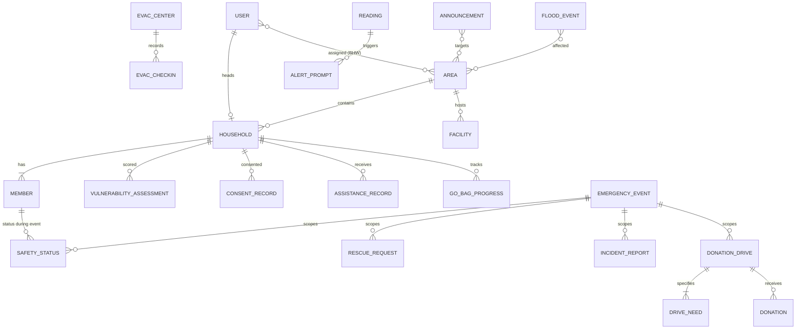

# Database Schema

**Project:** `SAGIP-SJ` (System for Alert, Guidance, Incident Reporting, and Preparedness) — Barangay San Jose Disaster Readiness & Community Health Platform
**Database:** PostgreSQL 16 + PostGIS 3.4
**Version:** 0.1 (Draft) · **Date:** August 2026

**Companions:** [`architecture.md`](./architecture.md) · [`frs_nfrs.md`](./frs_nfrs.md) · [`tech_stack.md`](./tech_stack.md)

> **Scope.** The physical data model — tables, columns, types, constraints, indexes. Service boundaries and query patterns are in `architecture.md`; _what_ the data is for is in `frs_nfrs.md`.

---

## 1. Conventions

| Concern          | Rule                                                                     |
| ---------------- | ------------------------------------------------------------------------ |
| Naming           | `snake_case`; singular table names (`household`, not `households`)       |
| Primary keys     | `id UUID PRIMARY KEY DEFAULT gen_random_uuid()`                          |
| Foreign keys     | `<referenced_table>_id`, always with an explicit `ON DELETE`             |
| Timestamps       | `TIMESTAMPTZ` only. **Never** `TIMESTAMP` — it silently drops the offset |
| Storage timezone | UTC. Conversion to PHT happens at render (NFR-DAT-003)                   |
| Soft delete      | `deleted_at TIMESTAMPTZ NULL`; default queries filter it out             |
| Enumerations     | `TEXT` + `CHECK` constraint — see below                                  |
| Booleans         | Prefixed `is_` / `has_`, `NOT NULL DEFAULT false`                        |
| Money            | Not stored. D-16 removes the entire donor transaction/payment surface.   |
| Geometry         | `GEOMETRY(<type>, 4326)` — WGS84 throughout, no reprojection anywhere    |

### Why `TEXT` + `CHECK` rather than native `ENUM`

Adding a value to a PostgreSQL `ENUM` requires `ALTER TYPE`, which is awkward inside a transaction and painful to reverse. A `CHECK` constraint is a one-line migration to widen. Several of these sets — announcement types, facility types — will change once the PubAd lead finishes their open items. SQLAlchemy treats both identically.

### Shared column groups

```sql
-- timestamps: on every table
created_at  TIMESTAMPTZ NOT NULL DEFAULT now(),
updated_at  TIMESTAMPTZ NOT NULL DEFAULT now(),

-- soft delete: on user-owned records
deleted_at  TIMESTAMPTZ,

-- attribution: on records created on someone's behalf
created_by_user_id UUID REFERENCES "user"(id) ON DELETE SET NULL,
```

---

## 2. Entity Overview



> `forecast` stands alone — it has no foreign keys and nothing references it. That
> isolation is the point: predictions never mix with observations. See Section 6.

**Table count: 40.** Grouped below by module.

---

## 3. Identity & Access

### `user`

| Column                                   | Type        | Constraints                        | Notes                                          |
| ---------------------------------------- | ----------- | ---------------------------------- | ---------------------------------------------- |
| `id`                                     | UUID        | PK                                 |                                                |
| `email`                                  | CITEXT      | UNIQUE NOT NULL                    | `citext` makes matching case-insensitive       |
| `password_hash`                          | TEXT        | NOT NULL                           | argon2 (NFR-SEC-001)                           |
| `full_name`                              | TEXT        | NOT NULL                           |                                                |
| `contact_number`                         | TEXT        |                                    |                                                |
| `role`                                   | TEXT        | NOT NULL CHECK                     | `head` · `bhw` · `admin` · `sk` · `superadmin` |
| `status`                                 | TEXT        | NOT NULL DEFAULT `'pending'` CHECK | `pending` · `active` · `disabled`              |
| `last_login_at`                          | TIMESTAMPTZ |                                    |                                                |
| `created_at`, `updated_at`, `deleted_at` | TIMESTAMPTZ |                                    |                                                |

```sql
CREATE INDEX idx_user_role_status ON "user"(role, status) WHERE deleted_at IS NULL;
```

> `public` is not a stored role — it is the absence of a user. Six roles in the BRD, five rows in this CHECK.

### `user_area` — BHW scoping (FR-SYS-007)

| Column        | Type        | Constraints                   |
| ------------- | ----------- | ----------------------------- |
| `user_id`     | UUID        | FK → `user` ON DELETE CASCADE |
| `area_id`     | UUID        | FK → `area` ON DELETE CASCADE |
| `assigned_at` | TIMESTAMPTZ | NOT NULL DEFAULT now()        |

`PRIMARY KEY (user_id, area_id)`

> This table is the enforcement point for area scoping. The repository joins against it by default for `bhw` users — see `architecture.md` Section 7.2.

### `refresh_token`

| Column             | Type        | Constraints                   | Notes                       |
| ------------------ | ----------- | ----------------------------- | --------------------------- |
| `id`               | UUID        | PK                            |                             |
| `user_id`          | UUID        | FK → `user` ON DELETE CASCADE |                             |
| `token_hash`       | TEXT        | UNIQUE NOT NULL               | **Hashed, never plaintext** |
| `expires_at`       | TIMESTAMPTZ | NOT NULL                      |                             |
| `revoked_at`       | TIMESTAMPTZ |                               | Set on logout               |
| `user_agent`, `ip` | TEXT        |                               | For session review          |

```sql
CREATE INDEX idx_refresh_user_active ON refresh_token(user_id) WHERE revoked_at IS NULL;
```

### `password_reset_token`

Same shape: `id`, `user_id`, `token_hash` UNIQUE, `expires_at`, `used_at`. Single-use.

### `audit_log` (FR-SYS-008)

| Column          | Type        | Constraints                    | Notes                                       |
| --------------- | ----------- | ------------------------------ | ------------------------------------------- |
| `id`            | BIGSERIAL   | PK                             | High volume; sequential is fine and cheaper |
| `actor_user_id` | UUID        | FK → `user` ON DELETE SET NULL | Null for system actions                     |
| `action`        | TEXT        | NOT NULL                       | `household.create`, `alert.publish`, …      |
| `entity_type`   | TEXT        | NOT NULL                       |                                             |
| `entity_id`     | UUID        |                                |                                             |
| `changes`       | JSONB       |                                | Before/after for updates                    |
| `ip`            | INET        |                                |                                             |
| `created_at`    | TIMESTAMPTZ | NOT NULL DEFAULT now()         |                                             |

```sql
CREATE INDEX idx_audit_entity  ON audit_log(entity_type, entity_id, created_at DESC);
CREATE INDEX idx_audit_actor   ON audit_log(actor_user_id, created_at DESC);
```

> **Append-only.** No update or delete path exists in the application.

---

## 4. Reference & Configuration

### `config` (FR-SYS-010, FR-ANL-002)

| Column               | Type        | Constraints            | Notes                                                  |
| -------------------- | ----------- | ---------------------- | ------------------------------------------------------ |
| `key`                | TEXT        | PK                     | `barangay.total_households`, `alert.threshold_level_1` |
| `value`              | JSONB       | NOT NULL               | Typed on read by Pydantic                              |
| `description`        | TEXT        |                        | Seed metadata for service consumers                    |
| `updated_by_user_id` | UUID        | FK → `user`            |                                                        |
| `updated_at`         | TIMESTAMPTZ | NOT NULL DEFAULT now() |                                                        |

Seed keys:

```
barangay.total_population        143031
barangay.total_households        <from LGU — BRD OI-12>
alert.threshold_level_1_m        <from MDRRMO — BRD OI-4>
alert.threshold_level_2_m
alert.threshold_level_3_m
reading.stale_after_minutes      45
weather.latitude / .longitude
```

> **This table is why FR-ANL-002 and FR-ANL-003 stay honest.** Barangay-wide totals live here as
> configuration; registered counts are always `COUNT(*)`. Two different things, two different
> mechanisms, never one column. Runtime services now read these values from the deployment
> environment (`BARANGAY_TOTAL_*` and `ALERT_THRESHOLD_LEVEL_*_M`); this table remains for
> migration compatibility and is not a console setup editor.

### `psgc` — address reference (FR-SYS-012)

| Column        | Type | Constraints                                        |
| ------------- | ---- | -------------------------------------------------- |
| `code`        | TEXT | PK — 10-digit PSGC code                            |
| `name`        | TEXT | NOT NULL                                           |
| `level`       | TEXT | CHECK: `region` · `province` · `city` · `barangay` |
| `parent_code` | TEXT | FK → `psgc(code)`                                  |

Single self-referencing table rather than four — the hierarchy is uniform and the cascading select is one recursive query.

### `area` — barangay zones (FR-SYS-013)

| Column            | Type                         | Constraints                       | Notes                                       |
| ----------------- | ---------------------------- | --------------------------------- | ------------------------------------------- |
| `id`              | UUID                         | PK                                |                                             |
| `name`            | TEXT                         | UNIQUE NOT NULL                   | "Area 1", "Area 2", …                       |
| `code`            | TEXT                         | UNIQUE                            | Short code for references                   |
| `geom`            | GEOMETRY(MultiPolygon, 4326) | **NULLABLE**                      | Boundary (BRD OI-3)                         |
| `centroid`        | GEOMETRY(Point, 4326)        |                                   | Generated; used for map labels              |
| `flood_exposure`  | TEXT                         | CHECK: `low` · `medium` · `high`  | Precomputed from hazard overlap             |
| `boundary_source` | TEXT                         | CHECK: `official` · `approximate` | Source of boundary polygon (FR-MAP-001/008) |

```sql
CREATE INDEX idx_area_geom ON area USING GIST(geom);
```

> **Boundaries are approximations for planning** (BR-2.8) — this table is not cadastral data and the UI says so.

> **`geom` is nullable, deliberately, and only until BRD OI-3 resolves.** The original design had
> it `NOT NULL`, which made it impossible to seed a single area row — and areas are the FK target
> for `household`, `facility`, `activity` and `announcement_area` — until the barangay supplies
> boundary polygons that do not exist yet. A null `geom` means "boundary not yet supplied", never
> "no such area". Every consumer that reads `geom` (map rendering, `ST_Contains` area assignment)
> must treat null as "nothing to draw / nothing to test", not as an error. Tighten back to
> `NOT NULL` once OI-3 lands and every row has a polygon.

### `facility` (FR-SYS-015)

| Column           | Type                  | Constraints           | Notes                                                                                                |
| ---------------- | --------------------- | --------------------- | ---------------------------------------------------------------------------------------------------- |
| `id`             | UUID                  | PK                    |                                                                                                      |
| `name`           | TEXT                  | NOT NULL              |                                                                                                      |
| `type`           | TEXT                  | NOT NULL CHECK        | `evacuation_center` · `hospital` · `clinic` · `barangay_hall` · `police` · `fire` · `rescue_station` |
| `address`        | TEXT                  |                       |                                                                                                      |
| `contact_number` | TEXT                  |                       |                                                                                                      |
| `location`       | GEOMETRY(Point, 4326) | NOT NULL              |                                                                                                      |
| `area_id`        | UUID                  | FK → `area`           | Derivable via `ST_Contains`                                                                          |
| `is_active`      | BOOLEAN               | NOT NULL DEFAULT true |                                                                                                      |

```sql
CREATE INDEX idx_facility_location ON facility USING GIST(location);
CREATE INDEX idx_facility_type ON facility(type) WHERE is_active;
```

### `siren` (FR-MAP-014, FR-ALT-012)

Visual siren simulation & alert unit point locations.

| Column              | Type                  | Constraints                   | Notes                                         |
| ------------------- | --------------------- | ----------------------------- | --------------------------------------------- |
| `id`                | UUID                  | PK                            |                                               |
| `name`              | TEXT                  | NOT NULL                      | e.g. "Riverside Area 1 Emergency Siren"       |
| `location`          | GEOMETRY(Point, 4326) | NOT NULL                      | Siren pin location on map                     |
| `area_id`           | UUID                  | FK → `area`                   | Derivable via `ST_Contains`                   |
| `status`            | TEXT                  | NOT NULL DEFAULT 'idle' CHECK | `idle` · `sounding` · `testing`               |
| `last_triggered_at` | TIMESTAMPTZ           |                               | Timestamp of last siren activation simulation |
| `is_active`         | BOOLEAN               | NOT NULL DEFAULT true         |                                               |

```sql
CREATE INDEX idx_siren_location ON siren USING GIST(location);
CREATE INDEX idx_siren_area ON siren(area_id);
```

### `hotline` (FR-SYS-014)

`id`, `label`, `number`, `type` (CHECK: `barangay` · `police` · `fire` · `ambulance` · `hospital` · `rescue` · `mdrrmo`), `sort_order`, `is_active`.

### `flood_hazard` (FR-MAP-003, FR-REG-043)

| Column          | Type                         | Constraints                     | Notes                     |
| --------------- | ---------------------------- | ------------------------------- | ------------------------- |
| `id`            | UUID                         | PK                              |                           |
| `return_period` | SMALLINT                     | NOT NULL CHECK IN (5, 25, 100)  | Years                     |
| `level`         | SMALLINT                     | NOT NULL CHECK IN (1, 2, 3)     | 1 Low · 2 Medium · 3 High |
| `geom`          | GEOMETRY(MultiPolygon, 4326) | NOT NULL                        | Dissolved by level        |
| `source`        | TEXT                         | NOT NULL DEFAULT `'NOAH/DREAM'` | Attribution (NFR-LGL-001) |

```sql
CREATE INDEX idx_hazard_geom ON flood_hazard USING GIST(geom);
CREATE UNIQUE INDEX idx_hazard_period_level ON flood_hazard(return_period, level);
```

> **Up to 9 rows** — three return periods × three levels, each a dissolved multipolygon. Only the 5-year period is sourced today (3 rows); 25-year and 100-year are added the same way once that data is available (`tech_stack.md` T-OI-7). Seeded by migration from the committed GeoJSON (`architecture.md` Section 11).

---

## 5. Community Registry

### `household` (FR-REG-001 … 011)

| Column                                   | Type                  | Constraints                           | Notes                                                                                                                                                                                     |
| ---------------------------------------- | --------------------- | ------------------------------------- | ----------------------------------------------------------------------------------------------------------------------------------------------------------------------------------------- |
| `id`                                     | UUID                  | PK                                    |                                                                                                                                                                                           |
| `reference_no`                           | TEXT                  | UNIQUE NOT NULL                       | Household Number in `M-SJ-000-000` format, generated at creation (FR-REG-006)                                                                                                             |
| `head_name`                              | TEXT                  | NOT NULL                              |                                                                                                                                                                                           |
| `head_user_id`                           | UUID                  | UNIQUE FK → `user` ON DELETE SET NULL | **Null for BHW-created records**                                                                                                                                                          |
| `contact_number`                         | TEXT                  |                                       | Nullable (FR-REG-005)                                                                                                                                                                     |
| `is_unreachable_by_phone`                | BOOLEAN               | NOT NULL DEFAULT false                | Derived on write; feeds capacity scoring                                                                                                                                                  |
| `area_id`                                | UUID                  | NOT NULL FK → `area`                  |                                                                                                                                                                                           |
| `psgc_barangay_code`                     | TEXT                  | FK → `psgc(code)`                     |                                                                                                                                                                                           |
| `street_address`                         | TEXT                  |                                       |                                                                                                                                                                                           |
| `location`                               | GEOMETRY(Point, 4326) |                                       | Nullable — pin is optional                                                                                                                                                                |
| `waterway_proximity`                     | TEXT                  |                                       | Nullable band: the flood hazard map supplies the initial `very_near` · `near` · `far` default; staff/residents may correct it from field observation; migration `0013_waterway_proximity` |
| `source`                                 | TEXT                  | NOT NULL CHECK                        | `self` · `bhw` — required for the coverage metric                                                                                                                                         |
| `created_by_user_id`                     | UUID                  | FK → `user` ON DELETE SET NULL        | The BHW, where applicable (FR-REG-007)                                                                                                                                                    |
| `verified_at`                            | TIMESTAMPTZ           |                                       |                                                                                                                                                                                           |
| `verified_by_user_id`                    | UUID                  | FK → `user`                           |                                                                                                                                                                                           |
| `stale_at`                               | TIMESTAMPTZ           |                                       | Set by the daily job (R-2)                                                                                                                                                                |
| `merged_into_id`                         | UUID                  | FK → `household`                      | Set when merged as a duplicate                                                                                                                                                            |
| `created_at`, `updated_at`, `deleted_at` | TIMESTAMPTZ           |                                       |                                                                                                                                                                                           |

```sql
CREATE INDEX idx_household_area     ON household(area_id) WHERE deleted_at IS NULL;
CREATE INDEX idx_household_location ON household USING GIST(location);
CREATE INDEX idx_household_source   ON household(source) WHERE deleted_at IS NULL;
CREATE INDEX idx_household_head     ON household(head_user_id);
-- duplicate detection support
CREATE INDEX idx_household_head_name_trgm ON household USING GIN(head_name gin_trgm_ops);
```

> **`head_user_id` is nullable and that is the whole point.** A BHW-created household is a complete, usable record with no account attached (FR-REG-002). Profile claiming is out of scope (BRD D-11), so this column stays null permanently for those records.

> **Verification does not gate service.** `verified_at` affects reporting confidence only — unverified households still count and still receive alerts (FR-REG-011).

### `member` (FR-REG-020 … 026)

| Column                                   | Type        | Constraints                                 | Notes                                   |
| ---------------------------------------- | ----------- | ------------------------------------------- | --------------------------------------- |
| `id`                                     | UUID        | PK                                          |                                         |
| `household_id`                           | UUID        | NOT NULL FK → `household` ON DELETE CASCADE |                                         |
| `full_name`                              | TEXT        | NOT NULL                                    |                                         |
| `birth_date`                             | DATE        |                                             | Age derived, never stored               |
| `sex`                                    | TEXT        | CHECK: `male` · `female`                    |                                         |
| `contact_number`                         | TEXT        |                                             | Optional citizen contact number         |
| `relationship_to_head`                   | TEXT        |                                             | FR-REG-023                              |
| `is_head`                                | BOOLEAN     | NOT NULL DEFAULT false                      | Exactly one per household               |
| `is_child`                               | BOOLEAN     | NOT NULL DEFAULT false                      | Derived from `birth_date` where present |
| `is_senior`                              | BOOLEAN     | NOT NULL DEFAULT false                      |                                         |
| `is_pwd`                                 | BOOLEAN     | NOT NULL DEFAULT false                      |                                         |
| `is_pregnant`                            | BOOLEAN     | NOT NULL DEFAULT false                      |                                         |
| `is_lactating`                           | BOOLEAN     | NOT NULL DEFAULT false                      |                                         |
| `has_chronic_condition`                  | BOOLEAN     | NOT NULL DEFAULT false                      | Requiring regular medication            |
| `chronic_condition_note`                 | TEXT        |                                             | Free text, optional                     |
| `is_bedridden`                           | BOOLEAN     | NOT NULL DEFAULT false                      | **Most decisive single factor**         |
| `created_at`, `updated_at`, `deleted_at` | TIMESTAMPTZ |                                             |                                         |

```sql
CREATE INDEX idx_member_household ON member(household_id) WHERE deleted_at IS NULL;
CREATE UNIQUE INDEX idx_member_one_head ON member(household_id) WHERE is_head AND deleted_at IS NULL;
-- fast vulnerable-member lookup for classification
CREATE INDEX idx_member_vulnerable ON member(household_id)
  WHERE (is_child OR is_senior OR is_pwd OR is_pregnant OR has_chronic_condition OR is_bedridden)
    AND deleted_at IS NULL;
```

> **Flags as booleans, not a lookup table.** The set is fixed by BR-1.32, small, and read on every classification pass. A join table would add cost and no flexibility that the CHECK-widening pattern does not already give.

### ~~`nutrition_record`~~ — **cut, Aug 2026** (was FR-REG-030 … 032)

> **Never migrated, and now never will be.** The team confirmed the platform will not collect clinical nutrition-assessment data (BRD D-15, closes OI-2). This table was documented but not implemented — no code change follows from the cut, only this note. The table shape below is kept for historical reference, not as a build target.

| Column                | Type         | Constraints                              | Notes                                                                                                                                                                 |
| --------------------- | ------------ | ---------------------------------------- | --------------------------------------------------------------------------------------------------------------------------------------------------------------------- |
| `id`                  | UUID         | PK                                       |                                                                                                                                                                       |
| `member_id`           | UUID         | NOT NULL FK → `member` ON DELETE CASCADE |                                                                                                                                                                       |
| `measured_at`         | DATE         | NOT NULL                                 |                                                                                                                                                                       |
| `weight_kg`           | NUMERIC(5,2) |                                          |                                                                                                                                                                       |
| `height_cm`           | NUMERIC(5,1) |                                          |                                                                                                                                                                       |
| `muac_cm`             | NUMERIC(4,1) |                                          | Mid-upper arm circumference — OPT+ standard                                                                                                                           |
| `indicators`          | JSONB        |                                          | **Extension point** — see below                                                                                                                                       |
| `status`              | TEXT         | CHECK                                    | Computed. Provisional set: `normal` · `underweight` · `severely_underweight` · `stunted` · `severely_stunted` · `wasted` · `severely_wasted` · `overweight` · `obese` |
| `computed_at`         | TIMESTAMPTZ  |                                          |                                                                                                                                                                       |
| `recorded_by_user_id` | UUID         | FK → `user`                              |                                                                                                                                                                       |

```sql
CREATE INDEX idx_nutrition_member_date ON nutrition_record(member_id, measured_at DESC);
```

### `vulnerability_assessment` (FR-REG-040 … 048)

| Column                | Type         | Constraints                                 | Notes                                                 |
| --------------------- | ------------ | ------------------------------------------- | ----------------------------------------------------- |
| `id`                  | UUID         | PK                                          |                                                       |
| `household_id`        | UUID         | NOT NULL FK → `household` ON DELETE CASCADE |                                                       |
| `computed_at`         | TIMESTAMPTZ  | NOT NULL DEFAULT now()                      |                                                       |
| `level`               | TEXT         | NOT NULL CHECK                              | `low` · `moderate` · `high` · `priority`              |
| `person_score`        | NUMERIC(5,2) |                                             | Group A                                               |
| `exposure_score`      | NUMERIC(5,2) |                                             | Group B                                               |
| `capacity_score`      | NUMERIC(5,2) |                                             | Group C — reduces                                     |
| `factors`             | JSONB        | NOT NULL                                    | Contributing factors, for explainability (FR-REG-045) |
| `override_level`      | TEXT         | CHECK — same set                            | FR-REG-046                                            |
| `override_reason`     | TEXT         |                                             | **Required when `override_level` is set**             |
| `override_by_user_id` | UUID         | FK → `user`                                 |                                                       |
| `override_at`         | TIMESTAMPTZ  |                                             |                                                       |
| `is_current`          | BOOLEAN      | NOT NULL DEFAULT true                       | Exactly one per household                             |

```sql
CREATE INDEX idx_vuln_household ON vulnerability_assessment(household_id, computed_at DESC);
CREATE UNIQUE INDEX idx_vuln_current ON vulnerability_assessment(household_id) WHERE is_current;

ALTER TABLE vulnerability_assessment ADD CONSTRAINT chk_override_reason
  CHECK (override_level IS NULL OR override_reason IS NOT NULL);
```

**Append-only.** A reclassification inserts a new row and flips `is_current` on the old one. Three things fall out of that for free: risk history per household, diagnosability when the classifier changes, and an audit trail on overrides.

`factors` shape:

```json
{
  "person": [{ "factor": "bedridden_member", "member_id": "…", "weight": 40 }],
  "exposure": [{ "factor": "flood_zone_high", "value": 3, "weight": 25 }],
  "capacity": [{ "factor": "no_contact_number", "weight": -10 }],
  "rule_applied": "most_vulnerable_member"
}
```

### ~~`feedback`~~ — **cut, Aug 2026** (was FR-REG-050 … 057)

> **Never migrated, and now never will be.** This table existed to carry BHW dietary guidance back to a resident. With nutrition-assessment data cut (BRD D-15), there is nothing for a health worker to give feedback on, so the whole loop — including this table — is withdrawn (closes OI-11, retires R-13). Kept below for historical reference only.

| Column                | Type        | Constraints                              | Notes                                                    |
| --------------------- | ----------- | ---------------------------------------- | -------------------------------------------------------- |
| `id`                  | UUID        | PK                                       |                                                          |
| `member_id`           | UUID        | NOT NULL FK → `member` ON DELETE CASCADE |                                                          |
| `body`                | TEXT        | NOT NULL                                 |                                                          |
| `origin`              | TEXT        | NOT NULL CHECK                           | `authored` · `drafted` — drafted means machine-generated |
| `status`              | TEXT        | NOT NULL DEFAULT `'draft'` CHECK         | `draft` · `published`                                    |
| `reviewed_by_user_id` | UUID        | FK → `user`                              |                                                          |
| `reviewed_at`         | TIMESTAMPTZ |                                          |                                                          |
| `published_at`        | TIMESTAMPTZ |                                          |                                                          |
| `source_reference`    | TEXT        |                                          | NNC / DOH / DOST-FNRI basis (formerly FR-REG-053)        |
| `author_user_id`      | UUID        | FK → `user`                              |                                                          |

```sql
CREATE INDEX idx_feedback_member ON feedback(member_id, published_at DESC);

-- formerly FR-REG-057: drafted guidance cannot be published without review
ALTER TABLE feedback ADD CONSTRAINT chk_drafted_requires_review
  CHECK (
    status <> 'published'
    OR origin = 'authored'
    OR (reviewed_by_user_id IS NOT NULL AND reviewed_at IS NOT NULL)
  );
```

### `consent_record` (FR-SYS-017)

`id`, `household_id`, `consent_version`, `consented_at`, `consented_by_user_id`, `method` (CHECK: `online` · `assisted`), `covers_members BOOLEAN NOT NULL DEFAULT true`.

### `household_merge` — duplicate resolution (FR-REG-010)

`id`, `kept_household_id`, `merged_household_id`, `merged_by_user_id`, `merged_at`, `notes`.

> **Implemented (Aug 2026).** Migration `0007_registry_dup_merge` — this table
> didn't exist until then; `household.merged_into_id` was the only column
> that did, with nowhere to record the merge event itself. `registry/service.py`'s
> `merge_households` demotes the losing household's head member
> (`is_head=false`) before re-parenting its members, since `idx_member_one_head`
> allows only one `is_head=true` row per household. The same migration adds the
> `pg_trgm`-backed GIN trigram index on `household.head_name` this table's
> duplicate-detection use case depends on, plus `household_reference_no_seq`
> for FR-REG-006.

---

## 6. Weather, River & Alerts

### `reading` (FR-WX-001 … 012)

| Column               | Type          | Constraints            | Notes                                                                                                                |
| -------------------- | ------------- | ---------------------- | -------------------------------------------------------------------------------------------------------------------- |
| `id`                 | BIGSERIAL     | PK                     | High volume                                                                                                          |
| `source`             | TEXT          | NOT NULL CHECK         | `open_meteo` · `pagasa` · `manual`                                                                                   |
| `metric`             | TEXT          | NOT NULL CHECK         | `river_level` · `rainfall` · `temperature` · `humidity` · `heat_index` · `precipitation_probability` · `tcws_signal` |
| `value`              | NUMERIC(10,3) | NOT NULL               |                                                                                                                      |
| `unit`               | TEXT          | NOT NULL               | `m`, `mm`, `°C`, `%`                                                                                                 |
| `station`            | TEXT          |                        | PAGASA station name                                                                                                  |
| `observed_at`        | TIMESTAMPTZ   | NOT NULL               | When the world was measured                                                                                          |
| `fetched_at`         | TIMESTAMPTZ   | NOT NULL DEFAULT now() | When we learned it                                                                                                   |
| `entered_by_user_id` | UUID          | FK → `user`            | Set only for `manual` (FR-WX-007)                                                                                    |
| `raw`                | JSONB         |                        | Original payload, for debugging a broken parser                                                                      |

```sql
CREATE INDEX idx_reading_latest ON reading(metric, source, observed_at DESC);
```

> **Two timestamps, and the gap between them is the staleness.** `observed_at` is what the reading describes; `fetched_at` is when we got it. FR-WX-011 computes staleness at read time against `STALE_THRESHOLD_MINUTES`. A value is never rendered without its age.

> **`manual` is a first-class source, not a fallback flag.** An admin-entered river level writes the same row shape with full attribution, so every downstream feature keeps working when the scraper dies mid-storm.

### `forecast` (FR-WX-002, FR-WX-015)

| Column       | Type          | Constraints            | Notes                               |
| ------------ | ------------- | ---------------------- | ----------------------------------- |
| `id`         | BIGSERIAL     | PK                     |                                     |
| `source`     | TEXT          | NOT NULL CHECK         | `open_meteo` · `pagasa`             |
| `metric`     | TEXT          | NOT NULL CHECK         | Same set as `reading.metric`        |
| `value`      | NUMERIC(10,3) | NOT NULL               |                                     |
| `unit`       | TEXT          | NOT NULL               |                                     |
| `valid_at`   | TIMESTAMPTZ   | NOT NULL               | The **future** moment this predicts |
| `horizon`    | TEXT          | NOT NULL CHECK         | `hourly` · `daily`                  |
| `fetched_at` | TIMESTAMPTZ   | NOT NULL DEFAULT now() | When this prediction was issued     |
| `raw`        | JSONB         |                        | Original payload                    |

```sql
CREATE UNIQUE INDEX idx_forecast_point
  ON forecast(source, metric, horizon, valid_at);
CREATE INDEX idx_forecast_upcoming ON forecast(metric, horizon, valid_at);
```

> **Why this is not a `kind` column on `reading`.** The tempting shortcut is
> `reading.kind IN ('observed','forecast')`, and it is a trap. `reading.observed_at`
> means "when the world was measured" — a forecast has no such moment, so the
> column would have to hold a future date and quietly change meaning per row.
> Every "latest reading" query — including the one behind the public river level
> and the staleness calculation — would then need a filter it currently does not
> have, and **a single missed filter renders a predicted value as the current
> one.** During a flood that is the worst bug this schema could produce.
>
> They also behave differently. A reading is an immutable historical fact and the
> table is append-only. A forecast is _superseded_: each fetch returns a fresh
> series that replaces the previous one for the same `valid_at`, which is what the
> unique index above enforces via upsert. Forecasts have no `station`, are never
> `manual` (FR-WX-007 is about observations), and are never subject to
> `STALE_THRESHOLD_MINUTES`.

### `alert_prompt` (FR-WX-009)

| Column                        | Type          | Constraints               | Notes                                    |
| ----------------------------- | ------------- | ------------------------- | ---------------------------------------- |
| `id`                          | UUID          | PK                        |                                          |
| `reading_id`                  | BIGINT        | FK → `reading`            | What triggered it                        |
| `level`                       | SMALLINT      | NOT NULL CHECK IN (1,2,3) |                                          |
| `threshold_value`             | NUMERIC(10,3) | NOT NULL                  | The configured value crossed             |
| `created_at`                  | TIMESTAMPTZ   | NOT NULL DEFAULT now()    |                                          |
| `acknowledged_by_user_id`     | UUID          | FK → `user`               |                                          |
| `acknowledged_at`             | TIMESTAMPTZ   |                           |                                          |
| `resulted_in_announcement_id` | UUID          | FK → `announcement`       | Null if the officer chose not to publish |

> **This table is where D-4 lives.** The scheduler writes an `alert_prompt`; publishing requires a named officer creating an `announcement`. No code path connects them automatically. `resulted_in_announcement_id` being null is a legitimate, recorded outcome — the officer looked and decided not to warn.

### `flood_event` (FR-WX-013)

| Column                 | Type          | Constraints                       | Notes                                  |
| ---------------------- | ------------- | --------------------------------- | -------------------------------------- |
| `id`                   | UUID          | PK                                |                                        |
| `emergency_event_id`   | UUID          | FK → `emergency_event` (SET NULL) | Auto-linked when declared from event   |
| `name`                 | TEXT          | NOT NULL                          | "Typhoon Ulysses (Vamco)"              |
| `started_at`           | TIMESTAMPTZ   | NOT NULL                          |                                        |
| `ended_at`             | TIMESTAMPTZ   |                                   | Null while ongoing                     |
| `peak_level_m`         | NUMERIC(10,3) |                                   |                                        |
| `peak_at`              | TIMESTAMPTZ   |                                   |                                        |
| `households_displaced` | INTEGER       |                                   | Recorded after the fact, often revised |
| `notes`                | TEXT          |                                   |                                        |

### `flood_event_area` (FR-WX-013)

`flood_event_id`, `area_id`, `PRIMARY KEY (flood_event_id, area_id)`.

> FR-WX-013 requires flood history to show "areas affected", and `flood_event`
> had nowhere to put them. Same shape as `announcement_area` deliberately — both
> answer "which parts of the barangay did this concern", and two different
> patterns for one question is how a schema starts drifting.
>
> Unlike `announcement_area`, an **empty set here means unrecorded, not
> barangay-wide.** Historical events predate the platform and their extent is
> whatever the barangay can reconstruct; the public view says "areas not recorded"
> rather than implying the whole barangay flooded.
>
> The admin editor's **Barangay-Wide Flood** shortcut records every currently
> available area in this join table. It does not add a flag or change the public
> contract; an empty set remains the explicit "not recorded" state.

### `announcement` (FR-ALT-001 … 015)

| Column               | Type        | Constraints           | Notes                                                                                                                                                                  |
| -------------------- | ----------- | --------------------- | ---------------------------------------------------------------------------------------------------------------------------------------------------------------------- |
| `id`                 | UUID        | PK                    |                                                                                                                                                                        |
| `kind`               | TEXT        | NOT NULL CHECK        | `announcement` · `alert` — one engine, two presentations                                                                                                               |
| `type`               | TEXT        | NOT NULL CHECK        | `general` · `class_suspension` · `road_closure` · `utility_interruption` · `flood_warning` · `earthquake` · `typhoon` · `heavy_rainfall` · `heat_index` · `evacuation` |
| `severity`           | TEXT        | CHECK                 | `info` · `warning` · `emergency`                                                                                                                                       |
| `title`              | TEXT        | NOT NULL              |                                                                                                                                                                        |
| `slug`               | TEXT        | UNIQUE NOT NULL       | Canonical public route                                                                                                                                                 |
| `excerpt`            | TEXT        | NOT NULL              | Plain-text article preview                                                                                                                                             |
| `body_json`          | JSONB       | NOT NULL              | Validated Tiptap document                                                                                                                                              |
| `publication_status` | TEXT        | NOT NULL CHECK        | `draft` · `published` · `archived`                                                                                                                                     |
| `instruction`        | TEXT        |                       | **Required when `kind = 'alert'`** (FR-ALT-005)                                                                                                                        |
| `is_barangay_wide`   | BOOLEAN     | NOT NULL DEFAULT true |                                                                                                                                                                        |
| `published_at`       | TIMESTAMPTZ |                       |                                                                                                                                                                        |
| `expires_at`         | TIMESTAMPTZ |                       |                                                                                                                                                                        |
| `deactivated_at`     | TIMESTAMPTZ |                       | FR-ALT-011                                                                                                                                                             |
| `archived_at`        | TIMESTAMPTZ |                       | Set when publication is archived                                                                                                                                       |
| `issued_by_user_id`  | UUID        | NOT NULL FK → `user`  | FR-ALT-007 — never null                                                                                                                                                |

```sql
ALTER TABLE announcement ADD CONSTRAINT chk_alert_needs_instruction
  CHECK (kind <> 'alert' OR instruction IS NOT NULL);

CREATE INDEX idx_announcement_active ON announcement(kind, published_at DESC)
  WHERE deactivated_at IS NULL;
```

> **An alert cannot be saved without telling people what to do.** FR-ALT-004 says alerts carry an instruction, not just information — enforced here rather than trusted to the form.

### `announcement_area` — targeting (FR-ALT-003)

`announcement_id`, `area_id`, `PRIMARY KEY (announcement_id, area_id)`. Empty means barangay-wide.

---

## 7. Safety, Rescue & Incidents

### `emergency_event`

`id`, `name`, `type` (CHECK: `flood` · `earthquake` · `typhoon` · `fire` · `other`), `started_at`, `ended_at`, `is_active`, `declared_by_user_id`.

Scopes safety statuses, rescue requests, incident reports, and donation drives so that "accounted for" always means _for this event_. Multiple rows may be active concurrently; operational requests carry an explicit `event_id`. Migration `0023_concurrent_emergency_operations` drops the former `idx_one_active_event` singleton constraint.

### `safety_status` (FR-SAF-001 … 007) — **implemented, migration `0008_safety_core`**

| Column                   | Type        | Constraints                                       | Notes                                           |
| ------------------------ | ----------- | ------------------------------------------------- | ----------------------------------------------- |
| `id`                     | UUID        | PK                                                |                                                 |
| `event_id`               | UUID        | NOT NULL FK → `emergency_event` ON DELETE CASCADE |                                                 |
| `member_id`              | UUID        | FK → `member` ON DELETE CASCADE                   | Null for unregistered persons                   |
| `unregistered_person_id` | UUID        | FK → `unregistered_person` ON DELETE CASCADE      | Null for registered members                     |
| `status`                 | TEXT        | NOT NULL CHECK                                    | `safe` · `needs_rescue` · `unaccounted`         |
| `set_by_user_id`         | UUID        | FK → `user` ON DELETE SET NULL                    | **Always the actor** — see deviation note below |
| `set_method`             | TEXT        | NOT NULL CHECK                                    | `self` · `assisted` · `household_bulk`          |
| `set_at`                 | TIMESTAMPTZ | NOT NULL DEFAULT now()                            | Officer backfill may supply the field-recorded time; system entry remains separately auditable |
| `superseded_at`          | TIMESTAMPTZ |                                                   | Corrections insert a new row (FR-SAF-006)       |

```sql
CREATE INDEX idx_safety_event_current ON safety_status(event_id, status) WHERE superseded_at IS NULL;

ALTER TABLE safety_status ADD CONSTRAINT chk_subject_exactly_one
  CHECK (num_nonnulls(member_id, unregistered_person_id) = 1);

-- Actual enforcement of "at most one current row per subject" — the prose
-- rule above was never mechanically enforced until these landed. Without
-- them two concurrent "safe" writes for one member both succeed and the
-- accounted-for dashboard double-counts.
CREATE UNIQUE INDEX uq_safety_current_member ON safety_status(event_id, member_id)
  WHERE superseded_at IS NULL AND member_id IS NOT NULL;
CREATE UNIQUE INDEX uq_safety_current_unreg ON safety_status(event_id, unregistered_person_id)
  WHERE superseded_at IS NULL AND unregistered_person_id IS NOT NULL;
```

> **`set_method` is what makes FR-SAF-005 possible.** The dashboard distinguishes individually confirmed statuses from those swept in by a household bulk action, so the BDRRMC can see how much confidence a "safe" count actually carries. Without this column the distinction cannot be made after the fact.

> **Deviation, documented (FR-REG-011 precedent): `set_by_user_id` is always the actor, never null.** This note used to say "null if self-set by the head" — that describes when null is _permitted_, but FR-SAF-007 requires recording _who_ set a status, and nulling it on self-set entries loses exactly that. `set_method` already carries the self/assisted/bulk distinction, so nothing is lost by also recording the actor.

### `unregistered_person` (FR-SAF-012, FR-EVC-005) — **implemented, migration `0008_safety_core`**

| Column                   | Type                  | Constraints                                       | Notes                                                                    |
| ------------------------ | --------------------- | ------------------------------------------------- | ------------------------------------------------------------------------ |
| `id`                     | UUID                  | PK                                                |                                                                          |
| `created_at`             | TIMESTAMPTZ           | NOT NULL DEFAULT now()                            | Not in the original design — recording _when_ is otherwise unrecoverable |
| `updated_at`             | TIMESTAMPTZ           | NOT NULL DEFAULT now()                            |                                                                          |
| `event_id`               | UUID                  | NOT NULL FK → `emergency_event` ON DELETE CASCADE |                                                                          |
| `full_name`              | TEXT                  | NOT NULL                                          | Name is the only required identity field                                 |
| `contact_number`         | TEXT                  |                                                   |                                                                          |
| `location`               | GEOMETRY(Point, 4326) |                                                   |                                                                          |
| `location_note`          | TEXT                  |                                                   | Free text — "near Wawa bridge"                                           |
| `recorded_by_user_id`    | UUID                  | FK → `user` ON DELETE SET NULL                    |                                                                          |
| `converted_household_id` | UUID                  | FK → `household` ON DELETE SET NULL               | Set once by registry-owned conversion                                    |
| `converted_member_id`    | UUID                  | FK → `member` ON DELETE SET NULL                  | Official identity created by conversion                                  |
| `is_child`               | BOOLEAN               | NOT NULL DEFAULT false                            | Operational support flag                                                 |
| `is_senior`              | BOOLEAN               | NOT NULL DEFAULT false                            | Operational support flag                                                 |
| `is_pwd`                 | BOOLEAN               | NOT NULL DEFAULT false                            | Operational support flag                                                 |
| `is_pregnant`            | BOOLEAN               | NOT NULL DEFAULT false                            | Operational support flag                                                 |
| `is_lactating`           | BOOLEAN               | NOT NULL DEFAULT false                            | Operational support flag                                                 |
| `has_chronic_condition`  | BOOLEAN               | NOT NULL DEFAULT false                            | Operational support flag                                                 |
| `chronic_condition_note` | TEXT                  |                                                   | Optional condition/medication note                                       |
| `is_bedridden`           | BOOLEAN               | NOT NULL DEFAULT false                            | Mobility-limited support flag                                            |

Indexes: `idx_unregistered_event(event_id)`, `idx_unregistered_location` GiST.

> Contact, location note, and map pin are optional. Converted rows remain historical and auditable but are excluded from live unregistered totals. The new member receives the equivalent event safety status and any open physical check-in.

### `rescue_request` (FR-SAF-008 … 010) — **implemented, migration `0008_safety_core`**

| Column                | Type                  | Constraints                               | Notes                                                                                                                                      |
| --------------------- | --------------------- | ----------------------------------------- | ------------------------------------------------------------------------------------------------------------------------------------------ |
| `id`                  | UUID                  | PK                                        |                                                                                                                                            |
| `created_at`          | TIMESTAMPTZ           | NOT NULL DEFAULT now()                    | Not in the original design — `idx_rescue_open` referenced this column without it ever being listed here; fixed alongside the migration     |
| `updated_at`          | TIMESTAMPTZ           | NOT NULL DEFAULT now()                    | The queue mutates on triage, so this is tracked like `TimestampMixin` elsewhere                                                            |
| `event_id`            | UUID                  | FK → `emergency_event` ON DELETE SET NULL | Nullable — a request may precede a declared event                                                                                          |
| `household_id`        | UUID                  | FK → `household` ON DELETE SET NULL       | **Nullable — anonymous requests**                                                                                                          |
| `requester_name`      | TEXT                  | NOT NULL                                  |                                                                                                                                            |
| `contact_number`      | TEXT                  |                                           |                                                                                                                                            |
| `location`            | GEOMETRY(Point, 4326) |                                           |                                                                                                                                            |
| `location_note`       | TEXT                  |                                           |                                                                                                                                            |
| `description`         | TEXT                  | NOT NULL                                  |                                                                                                                                            |
| `people_count`        | INTEGER               |                                           |                                                                                                                                            |
| `status`              | TEXT                  | NOT NULL DEFAULT `'pending'` CHECK        | `pending` · `verified` · `dispatched` · `resolved` · `dismissed`                                                                           |
| `priority`            | INTEGER               |                                           | Computed at triage (`FR-SAF-010`, not yet built)                                                                                           |
| `vulnerability_level` | TEXT                  |                                           | Left NULL by design — see the FR-SAF-010 deviation note in `frs_nfrs.md` §9; a made-up level would poison this column once BRD OI-18 lands |
| `assigned_to_user_id` | UUID                  | FK → `user` ON DELETE SET NULL            |                                                                                                                                            |
| `resolved_at`         | TIMESTAMPTZ           |                                           |                                                                                                                                            |
| `resolution_note`     | TEXT                  |                                           |                                                                                                                                            |
| `source_ip`           | INET                  |                                           | Abuse investigation only — never in a response DTO                                                                                         |

```sql
CREATE INDEX idx_rescue_open ON rescue_request(status, priority, created_at)
  WHERE status IN ('pending','verified','dispatched');
CREATE INDEX idx_rescue_location ON rescue_request USING GIST(location);
```

> **`household_id` is nullable and that is FR-SAF-009.** Nobody registers during an emergency to ask for help. Anonymous requests are triaged on the reported situation alone and are **not** ranked below registered ones by default (FR-SAF-010).

> **Known follow-up for the FR-SAF-010 phase:** the migrated index above orders by plain `priority`, not `priority DESC`. The triage design ("higher number = more urgent") needs `priority DESC` to actually benefit from this index — confirm and fix (a new migration, not an edit to `0008`) when that phase lands.

### `incident_report` (FR-SAF-015, 016)

`id`, `event_id`, `reported_by_user_id` (nullable), `type` (CHECK: `flooding` · `fire` · `fallen_tree` · `road_blockage` · `landslide` · `power_outage` · `other`), `description`, `location`, `location_note`, `photo_path`, `status` (CHECK: `pending` · `verified` · `dismissed`), `verified_by_user_id`, `verified_at`.

---

## 8. Evacuation Centers

### `evac_center` (FR-EVC-001 … 003)

`id`, `facility_id` FK → `facility`, `capacity`, `contact_person`, `contact_number`, `is_open`, `notes`.

### `evac_checkin` (FR-EVC-004, 005)

| Column                   | Type        | Constraints            | Notes                               |
| ------------------------ | ----------- | ---------------------- | ----------------------------------- |
| `id`                     | UUID        | PK                     |                                     |
| `evac_center_id`         | UUID        | NOT NULL FK            |                                     |
| `event_id`               | UUID        | NOT NULL FK            |                                     |
| `member_id`              | UUID        | FK → `member`          | Null for unregistered               |
| `unregistered_person_id` | UUID        | FK                     | Null for registered                 |
| `person_name`            | TEXT        | NOT NULL               | Denormalised display/audit snapshot |
| `checked_in_at`          | TIMESTAMPTZ | NOT NULL DEFAULT now() |                                     |
| `checked_out_at`         | TIMESTAMPTZ |                        |                                     |
| `recorded_by_user_id`    | UUID        | FK → `user`            |                                     |

```sql
CREATE INDEX idx_checkin_occupancy ON evac_checkin(evac_center_id)
  WHERE checked_out_at IS NULL;
ALTER TABLE evac_checkin ADD CONSTRAINT chk_evac_checkin_subject_exactly_one
  CHECK (num_nonnulls(member_id, unregistered_person_id) = 1);
CREATE UNIQUE INDEX uq_evac_checkin_open_member ON evac_checkin(member_id)
  WHERE checked_out_at IS NULL AND member_id IS NOT NULL;
CREATE UNIQUE INDEX uq_evac_checkin_open_unregistered ON evac_checkin(unregistered_person_id)
  WHERE checked_out_at IS NULL AND unregistered_person_id IS NOT NULL;
```

> Occupancy is the global physical `COUNT(*) WHERE checked_out_at IS NULL`, not a sum of per-event statuses. A person can have only one open check-in across concurrent events. Ending an intermediate event preserves it; ending the final active event checks out all open rows.

### `evac_supply` (FR-EVC-006, 007)

`id`, `evac_center_id`, `category` (CHECK: `food` · `water` · `medicine` · `hygiene` · `other`), `item_name`, `quantity`, `unit`, `updated_at`, `updated_by_user_id`.

---

## 9. Donation notices

> Migration `0018_article_cms` removed the former `drive_need`, `donation`, and
> `assistance_record` tables. Donation notices are informational only: no donor records,
> quantities, targets, payments, or distribution tracking remain in the product.

### `donation_drive` (FR-DON-015 … 017)

`id`, `event_id` (nullable), `title`, `slug` UNIQUE, `excerpt`, `body_json`,
`publication_status` (CHECK: `draft` · `published` · `archived`), `published_at`, `archived_at`,
`organizer_name`, `organizer_contact`, `drop_off_instructions`, `active_from`, `active_until`,
`created_by_user_id`.

---

## 10. Activities & Volunteers

### `activity` (FR-ACT-001 … 003)

`id`, `title`, `slug` UNIQUE, `excerpt`, `body_json`, `publication_status` (CHECK: `draft` ·
`published` · `archived`), `published_at`, `archived_at`, `type` (CHECK: `drill` · `seminar` ·
`first_aid` · `cleanup` · `tree_planting` · `ngo_program` · `other`), `starts_at`, `ends_at`,
`venue`, `area_id` (nullable), `created_by_user_id`.

### `activity_attendance` (FR-ACT-004, 007)

`id`, `activity_id`, `user_id` (nullable), `member_id` (nullable), `intent` (CHECK: `attending` · `not_attending`), `attended BOOLEAN`, `recorded_by_user_id`.
`UNIQUE (activity_id, user_id)`

### `volunteer` (FR-ACT-006)

`id`, `user_id` UNIQUE, `registered_at`, `is_active`, `notes`.

### `volunteer_skill`

`volunteer_id`, `skill` TEXT, `PRIMARY KEY (volunteer_id, skill)`.

### `volunteer_assignment` (FR-ACT-008)

`id`, `volunteer_id`, `event_id`, `task`, `status`, `assigned_by_user_id`.

### `training_certificate` (FR-ACT-009)

`id`, `volunteer_id`, `activity_id`, `issued_at`, `certificate_no`.

---

## 10a. Article-CMS schema (migration `0018_article_cms`)

Migration `0018_article_cms` implements `FR-ALT-013`–`015`, `FR-ACT-010`–`012`,
`FR-DON-015`–`017`, and `FR-PUB-019`–`020`. This section documents the shared physical
shape that supplements the parent-table summaries above.

### Shared article fields on three separate parent tables

`announcement`, `activity`, and `donation_drive` remain separate entities. Each has:

| Column               | Type        | Constraints                      | Notes                                                                    |
| -------------------- | ----------- | -------------------------------- | ------------------------------------------------------------------------ |
| `slug`               | TEXT        | UNIQUE NOT NULL                  | Unique within its parent table; canonical public route                   |
| `excerpt`            | TEXT        | NOT NULL                         | Plain-text preview summary                                               |
| `body_json`          | JSONB       | NOT NULL                         | Validated Tiptap document; plain text was backfilled in migration `0018` |
| `publication_status` | TEXT        | NOT NULL DEFAULT `'draft'` CHECK | `draft` · `published` · `archived`                                       |
| `published_at`       | TIMESTAMPTZ |                                  | Set by the server on first publication                                   |
| `archived_at`        | TIMESTAMPTZ |                                  | Set by the server on archive                                             |

Existing actor fields remain authoritative: `announcement.issued_by_user_id`,
`activity.created_by_user_id`, and `donation_drive.created_by_user_id`. Announcement alert fields
and area targeting remain unchanged. Activity type, schedule, venue, and area remain unchanged.

`donation_drive` additionally gains `organizer_name`, `organizer_contact`,
`drop_off_instructions`, `active_from`, and `active_until`; `event_id` stays optional. It does not
gain item, donor, pledge, quantity, receipt, payment, recipient, or distribution fields.

### Entity-specific image tables

`announcement_image`, `activity_image`, and `donation_drive_image` have the same
physical shape but a real foreign key to its own parent—no polymorphic `content_type/content_id`
pair.

| Column        | Type        | Constraints                    | Notes                                                      |
| ------------- | ----------- | ------------------------------ | ---------------------------------------------------------- |
| `id`          | UUID        | PK                             |                                                            |
| `<parent>_id` | UUID        | NOT NULL FK, ON DELETE CASCADE | Parent-specific column                                     |
| `file_path`   | TEXT        | NOT NULL UNIQUE                | Relative to the uploads volume; UUID filename              |
| `sort_order`  | INTEGER     | NOT NULL                       | Unique per parent                                          |
| `is_cover`    | BOOLEAN     | NOT NULL DEFAULT false         | Partial unique index enforces at most one cover per parent |
| `created_at`  | TIMESTAMPTZ | NOT NULL DEFAULT now()         |                                                            |

> Image records intentionally do not carry `alt_text` or `caption`. Those fields were removed in
> migration `0019_rm_article_image_meta`; the shared portal gallery only needs ordering, cover
> selection, and file provenance.

The service enforces a maximum of ten images and exactly one cover at publication. Uploads accept
JPEG, PNG, or WebP up to 5 MB, validated by magic bytes. Rich-text JSON cannot contain image nodes,
raw HTML, data URLs, or arbitrary nodes/marks outside the configured allow-list.

### Migration execution

`0018_article_cms` added nullable fields and image tables, backfilled existing content to valid
Tiptap JSON and deterministic slugs, made article fields required, then dropped `drive_need`,
`donation`, and `assistance_record`. Its downgrade recreates the retired tables empty; restore a
database backup rather than relying on downgrade if retired transaction data is needed.

---

## 11. Preparedness

### `guide` (FR-PRP-001, 003, 007)

`id`, `slug` UNIQUE, `hazard_type` (CHECK: `flood` · `earthquake` · `typhoon` · `fire` · `landslide` · `general` · `food`), `title_fil`, `title_en`, `body_fil`, `body_en`, `phase` (CHECK: `before` · `during` · `after` · `n/a`), `source_attribution`, `last_reviewed_at`, `is_published`, `sort_order`.

> **Bilingual columns rather than a translation table.** Two languages, fixed (BR-0.19). A translation table would add a join to every read for no benefit at this scale.

### `faq` (FR-PRP-005)

`id`, `question_fil`, `question_en`, `answer_fil`, `answer_en`, `category`, `sort_order`, `is_published`.

### `go_bag_item` — catalogue (FR-PRP-002)

`id`, `name_fil`, `name_en`, `category`, `is_essential`, `sort_order`.

### `go_bag_progress` (FR-PRP-002, 008)

`household_id`, `go_bag_item_id`, `has_item BOOLEAN NOT NULL DEFAULT false`, `updated_at`.
`PRIMARY KEY (household_id, go_bag_item_id)`

> Completion feeds the capacity group of the vulnerability classifier (FR-PRP-008).

### `family_emergency_plan` (FR-PRP-006)

`id`, `household_id` UNIQUE, `meeting_point`, `out_of_area_contact`, `notes`, `updated_at`.

---

## 12. Notifications

### `notification` (FR-SYS-011)

`id`, `user_id`, `type` (CHECK: `alert` · `activity_reminder` · `assistance` · `system`), `title`, `body`, `link_path`, `read_at`, `created_at`. (`feedback` was dropped from the set, Aug 2026 — the `feedback` table it notified for is cut.) The deployed CHECK still accepts the legacy `assistance` value; D-16 prohibits creating those notifications, and the later donation-retirement migration should remove the value.

```sql
CREATE INDEX idx_notification_unread ON notification(user_id, created_at DESC) WHERE read_at IS NULL;
```

---

## 13. Extensions Required

```sql
CREATE EXTENSION IF NOT EXISTS postgis;      -- spatial types and functions
CREATE EXTENSION IF NOT EXISTS pgcrypto;     -- gen_random_uuid()
CREATE EXTENSION IF NOT EXISTS citext;       -- case-insensitive email
CREATE EXTENSION IF NOT EXISTS pg_trgm;      -- fuzzy name matching for duplicate detection
```

---

## 14. Index Summary

| Kind               | Tables                                                                                                                          | Purpose                                                                                                                                  |
| ------------------ | ------------------------------------------------------------------------------------------------------------------------------- | ---------------------------------------------------------------------------------------------------------------------------------------- |
| **GiST spatial**   | `area.geom`, `household.location`, `facility.location`, `flood_hazard.geom`                                                     | Every `ST_Contains` / `ST_Distance` query                                                                                                |
| **GIN trigram**    | `household.head_name`                                                                                                           | Duplicate detection (FR-REG-010)                                                                                                         |
| **Partial**        | active alerts, open rescues, current occupancy, unread notifications, current assessments                                       | Keeps hot queries scanning only live rows                                                                                                |
| **Composite**      | `reading(metric, source, observed_at DESC)`                                                                                     | Latest-reading lookup, hit on every page                                                                                                 |
| **Unique**         | `forecast(source, metric, horizon, valid_at)`                                                                                   | Makes each fetch an upsert, so a refreshed series replaces the old one instead of accumulating duplicate predictions for the same moment |
| **Unique partial** | one head per household, one current assessment, one current safety row per event/subject, one open physical check-in per person | Invariants enforced by the database                                                                                                      |

---

## 15. Seed Data

Loaded by migration, not at runtime (NFR-DAT-007).

| Data            | Source                                                                                                              | Rows                |
| --------------- | ------------------------------------------------------------------------------------------------------------------- | ------------------- |
| PSGC hierarchy  | Team's PSGC library                                                                                                 | ~42,000             |
| Barangay areas  | Approximate labelled polygons, migration `0011_area_boundaries`; replace when BRD OI-3 supplies official boundaries | 6                   |
| Flood hazard    | `dataset/raw/Rizal_Flood_5year.shp` → `dataset/derived/san_jose_flood_5yr.geojson`                                  | 3 (5yr only, today) |
| Hotlines        | Barangay                                                                                                            | ~8                  |
| Facilities      | August 11 demo snapshot — 14 researched evacuation centres plus 7 synthetic service facilities                      | 21                  |
| Go-bag items    | NDRRMC standard list                                                                                                | ~15                 |
| Config defaults | This document Section 4                                                                                             | ~12                 |
| Demo households | Generated, marked synthetic                                                                                         | ~200                |

---

## 16. Data Lifecycle

| Concern     | Rule                                                                                           |
| ----------- | ---------------------------------------------------------------------------------------------- |
| Soft delete | `household`, `member`, `user` — default query filter excludes `deleted_at IS NOT NULL`         |
| Hard delete | Only on a privacy request (FR-SYS-018), cascading through members and assessments              |
| Append-only | `audit_log`, `vulnerability_assessment`, `reading`, `safety_status`                            |
| Retention   | `reading` older than 2 years may be downsampled; audit log retained indefinitely at this scale |
| Backups     | Daily `pg_dump`, off-box, restore verified before the pitch (NFR-AVL-006)                      |

---

## 17. Open Schema Decisions

| #          | Item                                                                                                                                                                                 | Blocked by | Owner                                                                                                           |
| ---------- | ------------------------------------------------------------------------------------------------------------------------------------------------------------------------------------ | ---------- | --------------------------------------------------------------------------------------------------------------- |
| ~~S-OI-1~~ | ~~Nutrition indicator columns~~                                                                                                                                                      | —          | **Resolved: moot.** `nutrition_record` is cut (BRD D-15, closes OI-2).                                          |
| S-OI-2     | Replace the deployed approximate area geometry with an official barangay-provided set when available                                                                                 | BRD OI-3   | PubAd lead                                                                                                      |
| S-OI-3     | Confirm local alert threshold values for `config`                                                                                                                                    | BRD OI-4   | PubAd lead                                                                                                      |
| S-OI-4     | Confirm barangay total households for `config`                                                                                                                                       | BRD OI-12  | PubAd lead                                                                                                      |
| S-OI-5     | Whether `vulnerability_assessment` scores are stored or recomputed on read. Stored remains the default because history matters more than space.                                      | —          | IT lead                                                                                                         |
| S-OI-6     | Whether `evac_checkin.person_name` should be dropped in favour of always creating an `unregistered_person` row                                                                       | FR-EVC-005 | IT lead                                                                                                         |
| ~~S-OI-7~~ | ~~Whether `announcement` needs a separate `alert` table~~                                                                                                                            | —          | **Resolved** — retain one table with `kind`; the article additions do not change alert ownership or delivery.   |
| ~~S-OI-8~~ | ~~Whether forecast data needs a separate table~~                                                                                                                                     | —          | **Resolved** — `forecast` is separate from immutable current readings (Section 6).                              |
| ~~S-OI-9~~ | ~~How affected areas attach to a flood event~~                                                                                                                                       | —          | **Resolved** — `flood_event_area` mirrors the targeting join; an empty set means unrecorded, not barangay-wide. |
| S-OI-10    | Whether `evac_center.contact_person` may be shown publicly. `contact_number` is an official line; a named individual remains excluded from the public DTO pending a policy decision. | FR-PUB-014 | PolSci lead                                                                                                     |

> **Interim values are profile defaults, not left unset.** `ALERT_THRESHOLD_LEVEL_{1,2,3}_M`
> defaults mirror the PAGASA FFWS Montalban gauge's own published
> `alertwl`/`alarmwl`/`criticalwl` values
> (22.40 / 23.00 / 23.60 m — confirmed live at `GET /water/map_list.do`, `tech_stack.md` §7).
> These are the gauge operator's own numbers, not an invented guess, and the `description`
> column says so explicitly: _"PAGASA Montalban gauge published value — pending MDRRMO
> confirmation (BRD OI-4)"_. The console no longer exposes a setup editor; update the
> service/deployment configuration through the controlled maintenance path when MDRRMO
> supplies a locally-confirmed figure. OI-4 is not resolved by this — it stays open — but the
> platform no longer runs on a blank threshold while it waits.
